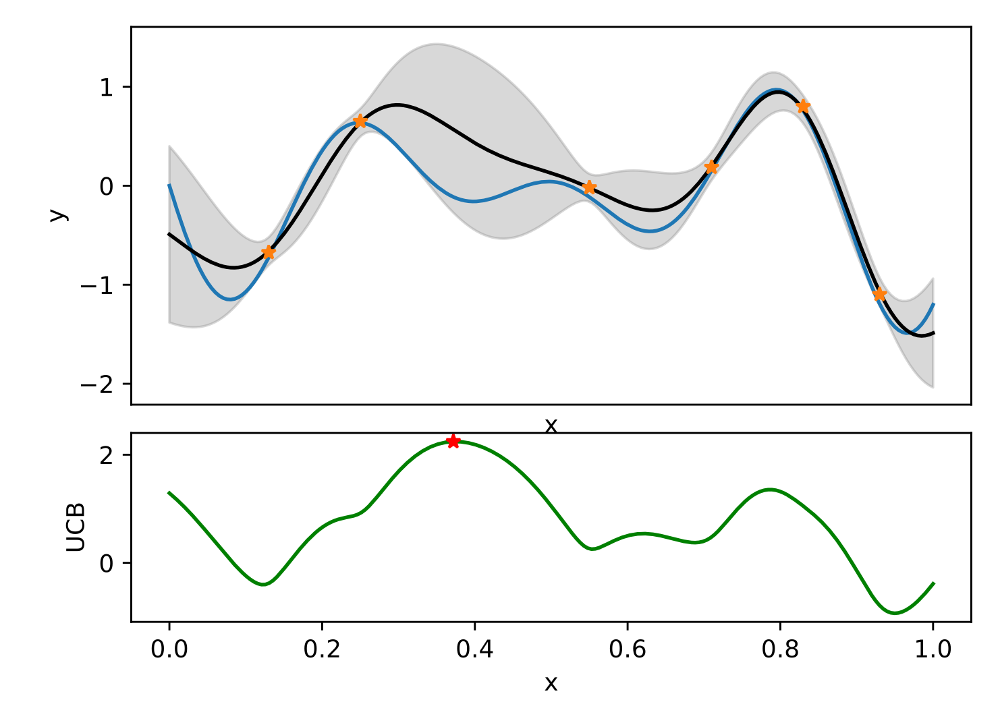

# Tutorial on introduction to Bayesian optimization

[](https://www.gnu.org/licenses/gpl-3.0)


- [Download the repository](#download-the-repository)
- [Getting started](#getting-started)
- [Running the tutorial](#running-the-tutorial)

## Material for this tutorial

- The tutorial in slide form can be [found here](https://machine-learning-tutorial.github.io/bayesian-optimization/#/)

## Download the repository

### Get the repository with Git

You will need to have Git previously installed in your computer.
To check if you have it installed, open your terminal and type:

``` bash
git --version
```

#### Git installation in MacOS

``` bash
brew update
brew install git
```

#### Git installation in Linux

In Ubuntu/Debian

``` bash
sudo apt install git
```

In CentOS

``` bash
sudo yum install git
```

Once you have Git installed open your terminal, go to your desired directory, and type:

``` bash
git clone https://github.com/machine-learning-tutorial/bayesian-optimization
cd bayesian-optimization
```

### Get the repository with direct download

Open your terminal, go to your desired directory, and type:

``` bash
wget https://github.com/machine-learning-tutorial/bayesian-optimization/archive/refs/heads/main.zip
unzip main.zip
cd bayesian-optimization
```

## Getting started

You need to install the dependencies before running the notebooks.

### Using conda

If you don't have conda installed already and want to use conda for environment management, you can install the miniconda as [described here](https://docs.conda.io/projects/miniconda/en/latest/miniconda-install.html).

- Create a conda env with `conda create -n bo-tutorial python=3.10`
- Activate the environment with `conda activate bo-tutorial`
- Install the required packages via `pip install -r requirements.txt`.
- Run the following commands:

```bash
python -m jupyter contrib nbextension install --user
python -m jupyter nbextension enable varInspector/main
```

- **After the tutorial** you can remove your environment with `conda remove -n bo-tutorial --all`

### Using venv only

If you do not have conda installed:

Alternatively, you can create the virtual env with `venv` in the standard library

```bash
python -m venv bo-tutorial
```

and activate the env with $ source <venv>/bin/activate (bash) or C:> <venv>/Scripts/activate.bat (Windows)

Then, install the packages with pip within the activated environment

```bash
python -m pip install -r requirements.txt
python -m jupyter contrib nbextension install --user
python -m jupyter nbextension enable varInspector/main
```

Afterwards, you should be able to run the provided notebooks.

## Running the tutorial

After installing the package

You can start the jupyter notebook in the terminal, and it will start a browser automatically

```bash
python -m jupyter notebook
```

Alternatively, you can use supported Editor to run the jupyter notebooks, e.g. with VS Code.

### Jupyter Notebooks

Use `cmd+Enter` to execute one cell block

## Citing the tutorial

This tutorial is registered [Zenodo](https://zenodo.org/), which means that there is a DOI for each code release.
Please use this DOI when citing this code:

## Disclaimer

The content of this repository was developed by the [AI4Accelerators team](https://www.ibpt.kit.edu/AI4Accelerators.php) at the [Institute of Beam Physics and Technology (IBPT)](https://www.ibpt.kit.edu/), [Karlsruhe Institute of Technology](https://www.kit.edu/english/).
